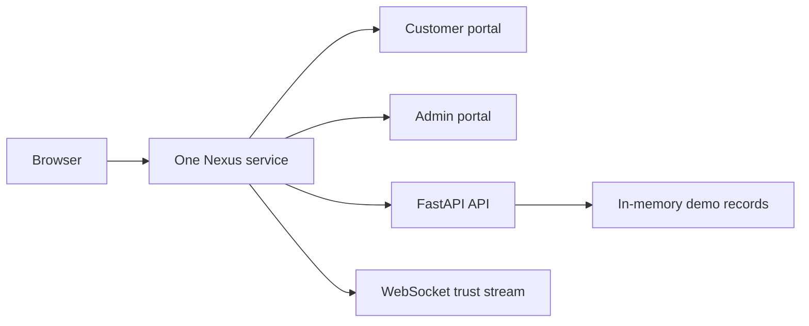

# Nexus BlockBank

Nexus BlockBank is a full-stack banking and identity-verification demonstration. It combines a customer banking portal, an administrative control console, FastAPI APIs, live trust-session updates, and simulated blockchain records in one deployable service.

## What runs where

One service hosts the entire application:

| Address | Purpose |
|---|---|
| `/` | Customer portal |
| `/admin/` | Administrative portal |
| `/health` | Service health check |
| `/auth/*`, `/api/*`, `/admin/*` | FastAPI endpoints |
| `/ws/trust/*` | Live customer trust-session connection |

The browser and API use the same domain in the deployed application. This removes the separate frontend host, backend host, proxy, and browser cross-origin setup.



## Main features

- Customer sign-in, banking overview, transfers, UPI payments, cards, loans, deposits, KYC, rewards, and support data
- Administrative sign-in, risk summary, validator nodes, smart-contract registry, credentials, verification review, and user controls
- Role-based customer and administrator access
- Password hashing, signed access tokens, and protected API routes
- Live trust-session stream using WebSockets
- Simulated blockchain metadata, audit events, and banking records

## Project structure

```text
Nexus/
├── client-app/          Customer React portal
├── admin-app/           Administrator React portal
├── backend/             FastAPI application and tests
├── Dockerfile           Builds and serves the complete application
├── render.yaml          Free Render deployment configuration
├── DEPLOYMENT.md        Beginner deployment guide
└── run_all.bat          Local development launcher
```

## Run locally for development

### 1. Install requirements

Install Python dependencies:

```powershell
cd backend
python -m pip install -r requirements-dev.txt
cd ..
```

Install frontend dependencies:

```powershell
npm --prefix client-app ci
npm --prefix admin-app ci
```

### 2. Start the three local development processes

Double-click `run_all.bat`, or run:

```powershell
.\run_all.bat
```

Open:

| Portal | Local address |
|---|---|
| Customer | `http://localhost:3000` |
| Administrator | `http://localhost:3001` |
| API health | `http://localhost:8000/health` |

The development servers forward application requests to FastAPI automatically.

## Run locally as one full-stack service

Install Docker Desktop, then run this from the repository root:

```powershell
docker build -t nexus-blockbank .
docker run --rm -p 8000:8000 --env APP_ENV=production --env DEMO_MODE=true --env JWT_SECRET=<32-character-secret> --env ADMIN_PASSWORD=<admin-password> --env DEMO_USER_PASSWORD=<demo-password> nexus-blockbank
```

Open `http://localhost:8000/` for the customer portal and `http://localhost:8000/admin/` for the administrator portal.

## Deploy the complete application

The repository is ready for a single Render Blueprint deployment. Follow the beginner click-by-click guide in [DEPLOYMENT.md](DEPLOYMENT.md).

During deployment, enter values for these protected settings:

| Setting | Purpose |
|---|---|
| `JWT_SECRET` | Signs login tokens; use a new value with 32 or more characters |
| `ADMIN_PASSWORD` | Password for the `superadmin` account |
| `DEMO_USER_PASSWORD` | Password for the `aarav_sharma` demo customer |

The Render service uses the free plan and publishes one public URL. Open that URL for the customer portal and append `/admin/` for the administrator portal.

## Configuration

Copy [`backend/.env.example`](backend/.env.example) for a production-style backend configuration. Frontend environment files are optional; leave them blank when using the included one-service Docker deployment.

| Variable | Required for public deploy | Description |
|---|---|---|
| `APP_ENV` | Yes | Set to `production` |
| `DEMO_MODE` | Yes | Keeps the seeded demo customer available |
| `JWT_SECRET` | Yes | Access-token signing secret |
| `ADMIN_PASSWORD` | Yes | Administrator password |
| `DEMO_USER_PASSWORD` | Yes when demo mode is enabled | Customer demo password |
| `PUBLIC_SIGNUP_ENABLED` | Recommended | Keep `false` for the shared demo |
| `WEB3_DEMO_AUTH_ENABLED` | Recommended | Keep `false` for the shared demo |

## Test the release

Run the backend tests from the repository root:

```powershell
python -m pytest backend/test_api.py -q
```

The test suite verifies authentication, role boundaries, payment validation, token revocation, the trust-session WebSocket, and serving both portals from one FastAPI application.

Build both portal bundles:

```powershell
npm --prefix client-app run build -- --base /
npm --prefix admin-app run build -- --base /admin/
```

## Demo accounts

| Account | Username | Password source |
|---|---|---|
| Customer | `aarav_sharma` | `DEMO_USER_PASSWORD` |
| Administrator | `superadmin` | `ADMIN_PASSWORD` |

## Known demo boundaries

- Records are stored in memory and reset when the service restarts.
- Blockchain, wallet, KYC, and banking-network values are simulated for demonstration.
- The free hosting plan sleeps after inactivity and may take time to wake.
- A production financial system needs durable data storage, recovery controls, monitoring, rate limits, account lockout, and real payment and identity providers.

## Reference links

- Repository: [Prashant44-cell/Nexus](https://github.com/Prashant44-cell/Nexus)
- API documentation when running locally: `http://localhost:8000/docs`
- Deployment guide: [DEPLOYMENT.md](DEPLOYMENT.md)
- Architecture graph: [graphify-out/graph.html](graphify-out/graph.html)
