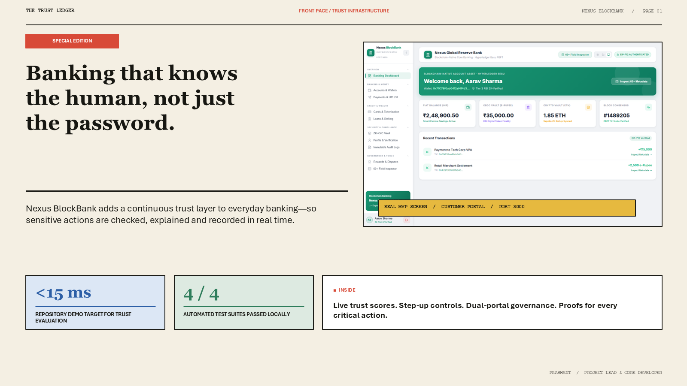
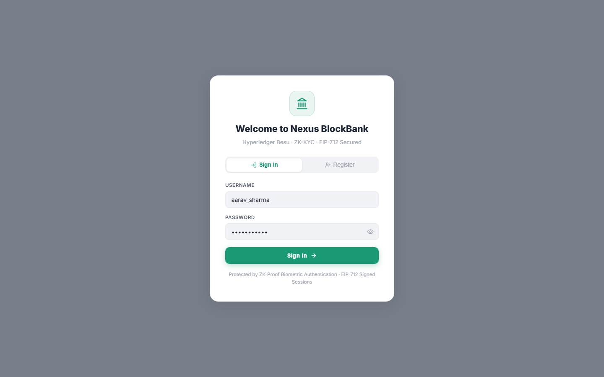
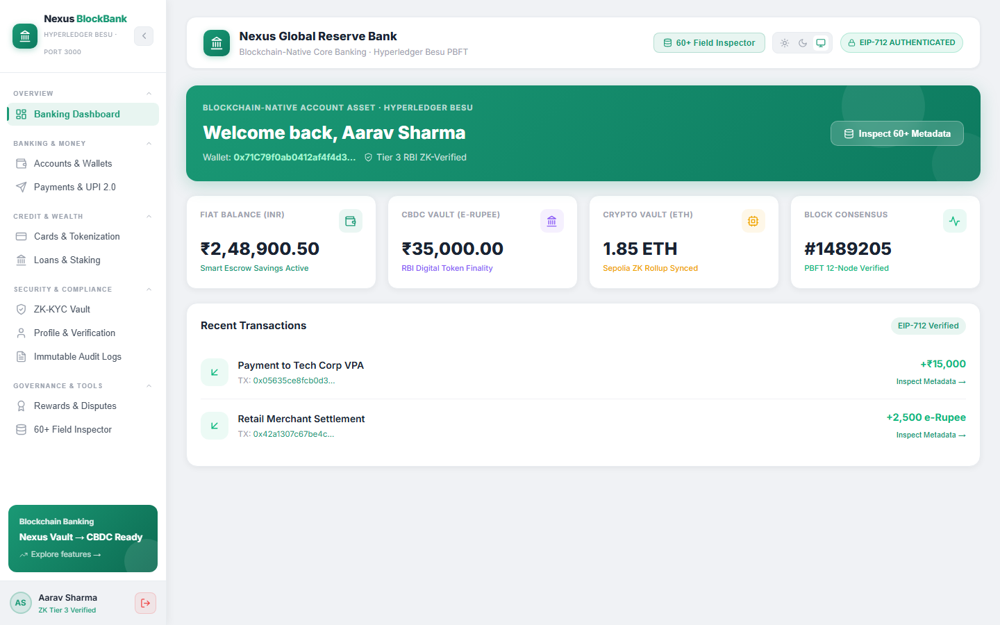
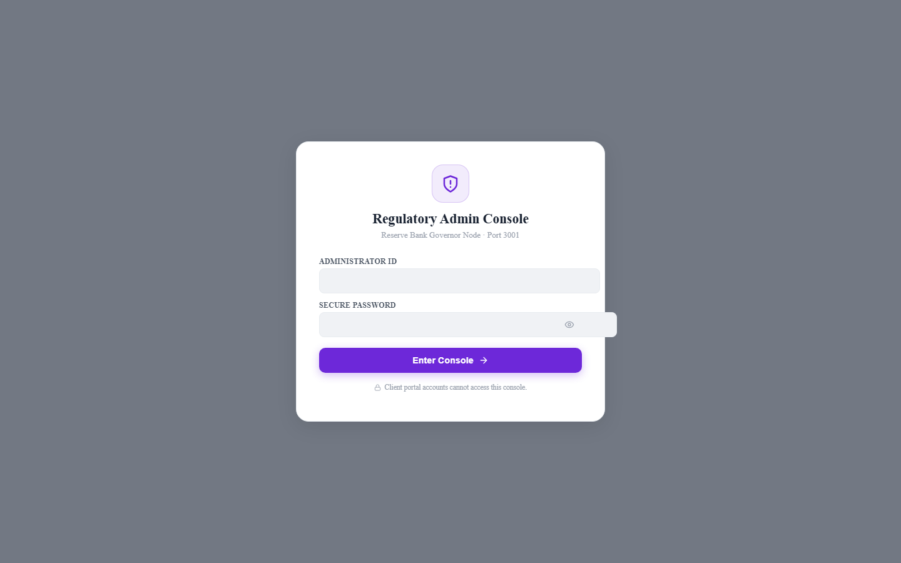
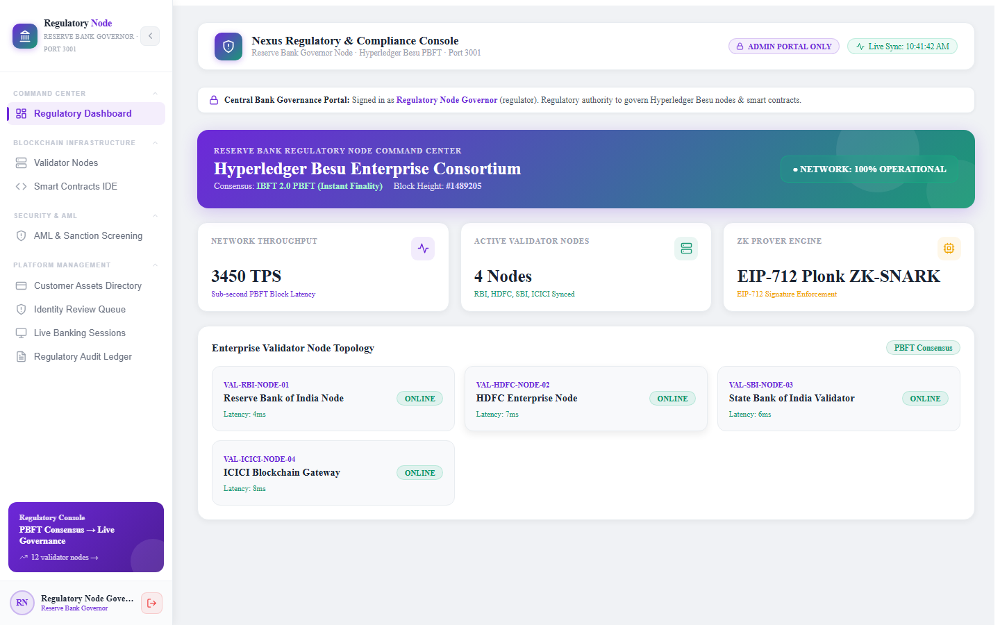
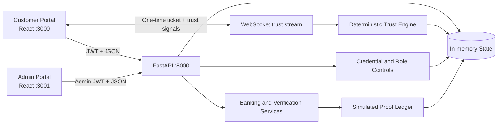
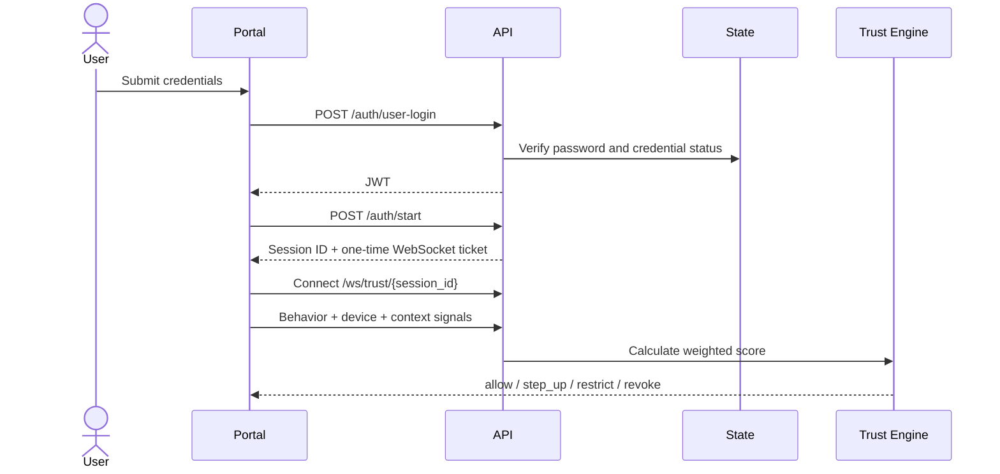
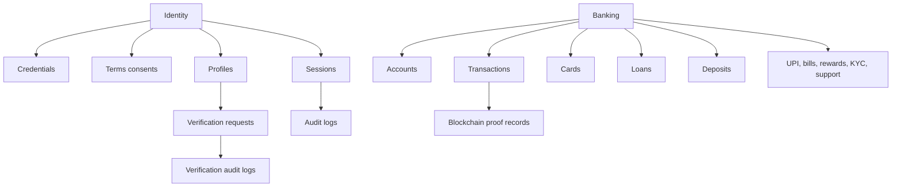
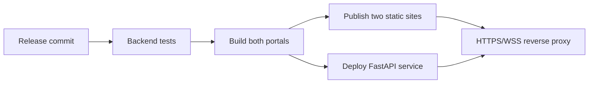

# Nexus BlockBank



**Continuous trust banking with customer self-service, regulator oversight, and auditable transaction proofs.**

[](#project-status)
[](http://localhost:8000/docs)
[](https://react.dev/)
[](https://fastapi.tiangolo.com/)
[](#testing)
[](#license)

> **Project status:** active hackathon prototype. The blockchain network, proof finality, compliance labels, and benchmark figures are simulated. The project is suitable for demonstrations and evaluation, not real financial transactions.

## Table of Contents

- [Overview](#overview)
- [Problem Statement](#problem-statement)
- [Features](#features)
- [Demo](#demo)
- [Tech Stack](#tech-stack)
- [Architecture](#architecture)
- [Workflow](#workflow)
- [Repository Structure](#repository-structure)
- [Prerequisites](#prerequisites)
- [Installation](#installation)
- [Environment Variables](#environment-variables)
- [Run Locally](#run-locally)
- [Database and State Model](#database-and-state-model)
- [API Overview](#api-overview)
- [Authentication and Authorization](#authentication-and-authorization)
- [Continuous Trust Engine](#continuous-trust-engine)
- [Testing](#testing)
- [Deployment](#deployment)
- [Security](#security)
- [Performance Notes](#performance-notes)
- [Reliability and Monitoring](#reliability-and-monitoring)
- [Limitations](#limitations)
- [Troubleshooting](#troubleshooting)
- [Development Workflow](#development-workflow)
- [Project Status](#project-status)
- [Roadmap](#roadmap)
- [References and Support](#references-and-support)
- [License](#license)

## Overview

Nexus BlockBank is a three-part banking demonstration:

1. A **customer portal** for accounts, payments, cards, loans, deposits, KYC, rewards, support, and identity verification.
2. An **admin and regulator portal** for risk monitoring, credentials, KYC review, validators, contracts, AML, and audits.
3. A **FastAPI service** for authentication, continuous trust scoring, banking actions, audit events, and simulated proof records.

The target audience is hackathon judges, fintech product teams, banking security teams, and developers exploring continuous session assurance. Its main idea is that authentication should not end at login: behavior, device, and context signals can continue to influence the session while sensitive actions remain traceable.

## Problem Statement

Digital banking commonly treats login, transaction risk, identity verification, and audit evidence as separate processes.

| Problem | Product response |
|---|---|
| A valid login can outlive the user's trust state | Re-evaluate behavior, device, and context throughout the session |
| Customers and operators need different control surfaces | Isolate customer and admin portals and enforce roles in the API |
| Sensitive actions need traceable evidence | Record audit events and deterministic proof hashes |
| Verification workflows are slow to coordinate | Connect customer submission with admin review and status history |

## Features

Customer capabilities:

- Login, signup, session start, and continuous trust stream
- Accounts, transfers, UPI, cards, loans, deposits, KYC, rewards, and support
- Profile creation, verification submission, and verification audit history
- Step-up challenge interface for medium-risk sessions

Admin and regulator capabilities:

- Risk summary, live sessions, AML/compliance, and audit views
- Credential issue, update, suspension, revocation, and deletion APIs
- Verification request approval and rejection
- Validator-node and smart-contract registry views

Platform capabilities:

- HS256 JWT access tokens with configurable expiry
- PBKDF2-HMAC-SHA256 password hashing with 310,000 iterations
- Customer/admin route guards and active-credential checks
- One-time WebSocket tickets stored only as hashes
- Pydantic validation for trust signals and financial amounts
- In-memory banking and identity state
- Simulated blockchain transaction and proof records
- OpenAPI documentation and Graphify architecture output

## Demo

Local services:

| Service | URL |
|---|---|
| Customer portal | http://localhost:3000 |
| Admin portal | http://localhost:3001 |
| API | http://localhost:8000 |
| Swagger UI | http://localhost:8000/docs |
| ReDoc | http://localhost:8000/redoc |

Development-only demo accounts:

| Portal | Username | Password |
|---|---|---|
| Customer | `aarav_sharma` | `password123` |
| Admin/regulator | `superadmin` | `SuperAdmin@2026` |

Production mode requires explicit admin credentials and should override every demo secret.

| Customer login | Customer dashboard |
|---|---|
|  |  |

| Admin login | Admin dashboard |
|---|---|
|  |  |

Project artifacts:

- [PowerPoint deck](Nexus_BlockBank_Hackathon_Deck.pptx)
- [Rendered PDF](deck_assets/rendered/Nexus_BlockBank_Hackathon_Deck.pdf)
- [Interactive architecture map](graphify-out/graph.html)

No hosted public demo URL is configured in this repository.

## Tech Stack

| Layer | Technologies |
|---|---|
| Customer frontend | React 18.2, Vite 4.4, Framer Motion, Lucide React, CSS |
| Admin frontend | React 18.2, Vite 4.4, Lucide React, CSS |
| Backend | Python 3.11+, FastAPI 0.141.1, Uvicorn 0.38.0, Pydantic 2.13.3 |
| Authentication | PyJWT 2.13.0, PBKDF2-HMAC-SHA256 |
| Realtime | WebSockets 15.0.1 |
| State | In-memory Python dictionaries, lists, and sets |
| Testing | Pytest 9.0.3, FastAPI TestClient, HTTPX2 2.12.0 |
| Project analysis | Graphify |
| Presentation | PowerPoint/PDF project deck |

AI/ML status: no external LLM, machine-learning model, embedding model, vector database, RAG pipeline, or AI API is connected. Continuous trust is a deterministic weighted rule. “AI screening” labels inside seeded metadata are demonstration text.

## Architecture



Component responsibilities:

- `client-app`: customer banking UI
- `admin-app`: governance and operations UI
- `backend/app/main.py`: API surface and request handling
- `backend/app/security.py`: token creation, token validation, role checks
- `backend/app/trust_engine.py`: trust evaluation logic
- `backend/app/blockchain_proof.py`: proof and transaction metadata simulation
- `backend/app/database.py`: shared in-memory state

There are no external databases, payment rails, wallet providers, KYC vendors, blockchain nodes, or model APIs connected in the current build.

Graphify output:

- Interactive graph: [`graphify-out/graph.html`](graphify-out/graph.html)
- Report: [`graphify-out/GRAPH_REPORT.md`](graphify-out/GRAPH_REPORT.md)

## Workflow

Authentication and continuous trust:



Banking action:

```text
Authenticated request
  → role check
  → request validation
  → in-memory state update
  → audit event
  → simulated proof hash
  → JSON response
```

Profile verification:

```text
Customer profile
  → proof submission
  → pending verification request
  → admin review
  → approved or rejected status
  → customer-visible audit history
```

## Repository Structure

```text
.
|-- backend/
|   |-- app/
|   |   |-- main.py
|   |   |-- security.py
|   |   |-- trust_engine.py
|   |   |-- blockchain_proof.py
|   |   |-- database.py
|   |   |-- config.py
|   |   `-- models.py
|   |-- requirements.txt
|   |-- requirements-dev.txt
|   `-- test_api.py
|-- client-app/
|   |-- src/
|   |-- public/
|   `-- package.json
|-- admin-app/
|   |-- src/
|   |-- public/
|   `-- package.json
|-- deck_assets/
|-- graphify-out/
|-- DEPLOYMENT.md
|-- run_all.bat
`-- README.md
```

## Prerequisites

- Python 3.11+
- Node.js 20+
- npm 10+

Optional for analysis and presentation artifacts:

- Graphify CLI
- PowerPoint-compatible viewer

No cloud account, database, blockchain wallet, or API key is required for the local demo.

## Installation

Clone and install each application:

```powershell
git clone https://github.com/Prashant44-cell/Fintech.git
cd Fintech

cd backend
python -m pip install -r requirements-dev.txt

cd ..\client-app
npm ci

cd ..\admin-app
npm ci
```

## Environment Variables

The tracked `.env.example` files document configuration values. The application reads process environment variables directly; it does **not** automatically load a local `.env` file.

Local development runs with safe-to-share demo defaults. For production, set the variables in the hosting platform or in the same shell that starts the backend.

| Variable | Development default | Purpose | Production requirement |
|---|---|---|---|
| `APP_ENV` | `development` | Enables production gates | Set to `production` |
| `DEMO_MODE` | `true` | Seeds demo customer data | Disable unless required |
| `PUBLIC_SIGNUP_ENABLED` | `true` | Allows customer signup | Usually `false` |
| `WEB3_DEMO_AUTH_ENABLED` | `true` | Enables simulated wallet auth | Set to `false` |
| `JWT_SECRET` | Local development secret | Signs access tokens | At least 32 random characters |
| `TOKEN_TTL_MINUTES` | `60` | Token lifetime | Set explicitly |
| `CORS_ORIGINS` | Local portal URLs | Allowed browser origins | Exact HTTPS origins; no wildcard |
| `ADMIN_USERNAME` | `superadmin` | Bootstrap admin username | Set explicitly |
| `ADMIN_PASSWORD` | Local demo password | Bootstrap admin password | Required and unique |
| `DEMO_USER_PASSWORD` | `password123` | Seeded customer password | Required if demo mode is enabled |
| `HOST` | `127.0.0.1` | Backend bind host | Commonly `0.0.0.0` |
| `PORT` | `8000` | Backend port | Set by host if needed |

Frontend env files:

- `client-app/.env.example`
- `admin-app/.env.example`

| Application | Variable | Purpose |
|---|---|---|
| Customer | `VITE_API_BASE_URL` | Public backend HTTP origin |
| Customer | `VITE_WS_BASE_URL` | Public backend WebSocket origin |
| Admin | `VITE_API_BASE_URL` | Public backend HTTP origin |

Leave a frontend value blank only when the hosting layer proxies `/api` and `/ws` to the backend.

## Run Locally

Launch everything:

```powershell
.\run_all.bat
```

Run separately:

```powershell
cd backend
python run.py
```

```powershell
cd client-app
npm run dev
```

```powershell
cd admin-app
npm run dev
```

Default local URLs:

- Customer portal: `http://localhost:3000`
- Admin portal: `http://localhost:3001`
- Backend API: `http://localhost:8000`

## Database and State Model

The current database is an `InMemoryDatabase` object initialized when the API process starts.



- State is shared by all users inside one process.
- State resets when the backend restarts.
- There are no schemas, migrations, backups, replicas, or recovery jobs.
- Seed records are created in `backend/app/database.py`.

This model supports a controlled demo only.

## API Overview

FastAPI generates the complete interactive contract:

- Swagger UI: http://localhost:8000/docs
- ReDoc: http://localhost:8000/redoc
- OpenAPI JSON: http://localhost:8000/openapi.json

Endpoint groups:

| Area | Routes | Access |
|---|---|---|
| Health | `GET /health` | Public |
| Password auth | `POST /auth/user-signup`, `/auth/user-login`, `/auth/admin-login` | Public; signup is flag-controlled |
| Demo Web3 auth | `POST /auth/signup`, `/auth/login` | Public; disabled by flag in production |
| Consent and credentials | `POST /terms/accept`, `/credential/issue`, `/credential/revoke` | Authenticated/admin as appropriate |
| Trust sessions | `POST /auth/start`, `/trust/evaluate`, `/auth/step-up`, `WS /ws/trust/{session_id}` | Customer or one-time ticket |
| Institution/admin | `GET /institution/overview`, `/admin/risk-summary`, `/audit/session/{session_id}` | Authenticated/admin as appropriate |
| User administration | `PUT /admin/users/update`, `POST /admin/users/suspend`, `DELETE /admin/users/{user_id}` | Admin roles |
| Accounts and transfers | `GET /api/banking/overview`, `/accounts`, `/transactions`; `POST /transfer` | Customer |
| Payments and cards | `GET /api/banking/upi`, `/cards`; `POST /upi/pay`, `/cards/freeze` | Customer |
| Lending and deposits | `GET /api/banking/loans`, `/deposits`; `POST /loans/apply`, `/deposits/create` | Customer |
| Customer services | `GET /api/banking/beneficiaries`, `/bills`, `/kyc`, `/rewards`, `/notifications`, `/support` | Customer |
| Metadata | `GET /api/banking/metadata/{object_id}` | Customer |
| Blockchain views | `GET /api/blockchain/nodes`, `/contracts` | Admin roles |
| Profile | `GET/POST /api/profile`, `POST /api/profile/verify`, `GET /api/profile/audit` | Customer |
| Verification review | `GET /api/admin/verifications`, `POST /api/admin/verifications/{request_id}/review` | Admin roles |

Common response codes:

| Code | Meaning |
|---|---|
| `200` | Successful request |
| `400` | Invalid business state or rejected input |
| `401` | Missing, invalid, expired, or revoked credential |
| `403` | Authenticated but not permitted, or feature disabled |
| `404` | Requested record does not exist |
| `422` | Request validation failed |

## Authentication and Authorization

Token model:

- HS256 bearer tokens include `sub`, `role`, `credential_id`, `consent_hash`, `iat`, and `exp`.
- The default lifetime is 60 minutes.
- Every protected request re-checks that the credential exists, is active, and has not been revoked.
- Logout removes the browser token; no server-side per-token denylist exists.

Role matrix:

| Capability | Customer | Branch manager | Admin | Regulator | Auditor |
|---|---:|---:|---:|---:|---:|
| Banking APIs | Yes | No | No | No | No |
| Customer trust session | Yes | No | No | No | No |
| Profile verification submission | Yes | No | No | No | No |
| Admin governance APIs | No | Yes | Yes | Yes | Yes |
| Validator and contract views | No | Yes | Yes | Yes | Yes |
| Verification review | No | Yes | Yes | Yes | Yes |

Public signup always creates a customer, even if the request contains a staff role. Session start returns a one-time WebSocket ticket; the server stores only its hash and ties the stream to session state.

## Continuous Trust Engine

Trust is calculated from three normalized inputs:

```text
trust score = (behavior × 0.35 + device × 0.35 + context × 0.30) × 100
```

| Score | Risk | Action |
|---:|---|---|
| 80–100 | Low | `allow` |
| 50–79.9 | Medium | `step_up` |
| Below 50 | High | `restrict` |
| Revoked credential | High | `revoke` |

Inputs are constrained to the 0–1 range. This is a deterministic demonstration policy, not a trained fraud or biometric model.

## Testing

Backend test command:

```powershell
cd backend
python -m pip install -r requirements-dev.txt
python -m pytest -q
```

Current release checks cover:

- Health endpoint
- Authenticated customer flows
- Admin/customer role isolation
- Anonymous access rejection
- Negative transfer validation
- Prevention of role escalation through signup
- Prevention of demo password bypasses
- Revoked credential enforcement
- Removal of hashed WebSocket ticket leakage from admin risk output

Frontend build checks:

```powershell
cd client-app
npm run build

cd ..\admin-app
npm run build
```

The dependency review on 20 August 2026 reported no known vulnerabilities from the Python and npm audits. This is a point-in-time result and should be rerun whenever dependencies change.

No automated coverage report, lint command, formatter, type checker, pre-commit hook, browser end-to-end suite, or CI workflow is configured yet.

## Deployment

Deployment instructions are in [`DEPLOYMENT.md`](DEPLOYMENT.md).

Production gate:

- Set `APP_ENV=production`
- Use explicit `CORS_ORIGINS`
- Replace every local secret and demo password
- Disable public signup unless required
- Disable demo Web3 auth
- Build both frontends with production API variables
- Put the API behind HTTPS/WSS



Docker files and a CI/CD pipeline are not present. Both frontends build to `dist/` and can be hosted as static sites; the API requires a Python application host.

## Security

Security hardening already present:

- JWT secret length enforcement
- Explicit production configuration checks
- Role-gated admin and customer routes
- Password hashing and verification
- Positive-value validation on money flows
- Sensitive field filtering for credentials and sessions
- Basic dependency audit completed during release preparation with no known vulnerable packages at that time

Current vulnerabilities and security gaps still present in this codebase:

1. Broken object-level authorization in banking data paths
   - Customer routes return shared demo collections instead of user-scoped records.
   - A signed-in customer can read common account, transaction, loan, card, and rewards data not partitioned per user.

2. Transfer authorization is not ownership-bound
   - `/api/banking/transfer` accepts any sender account number found in the shared dataset.
   - The backend checks balance, but not whether the current user owns that account.

3. Demo Web3 login remains unsafe if enabled
   - `WEB3_DEMO_AUTH_ENABLED=true` keeps a simulation path that does not perform real wallet nonce-signature verification.
   - Unknown wallets can fall back to demo behavior, which is acceptable only for a controlled demo.

4. No rate limiting or login lockout
   - The API currently has no brute-force throttling, lockout, or abuse protection on auth endpoints.

5. No persistent, encrypted storage
   - Sensitive business records live in memory only.
   - There is no durable encrypted database, rotation, backup, or retention control.

6. No transport enforcement inside the app itself
   - The application assumes deployment behind HTTPS/WSS but does not terminate TLS on its own.

7. Admin bootstrap credentials depend on environment discipline
   - Production startup enforces presence, but weak operational handling would still expose the platform.

8. Access tokens cannot be individually invalidated before expiry
   - A stolen active token remains usable until expiry unless the entire credential is revoked.

9. Banking mutations have no idempotency keys
   - A client retry can duplicate a transfer, UPI payment, loan application, or deposit.

10. Staff roles share broad administrative access
    - Auditor, branch manager, regulator, and admin roles are accepted by the same route guard instead of operation-specific permissions.

11. Audit retention is process-local
    - Restarting the backend removes security evidence, and no external monitoring or alerting consumes the events.

The highest-risk release blockers are tenant isolation and account ownership enforcement. Package-level audits were clean at the recorded review date.

## Performance Notes

Demo targets currently documented in the project:

- Trust evaluation latency target: under 15 ms
- P95 transaction finality target: 84 ms
- FAR target: under 0.12%
- FRR target: under 0.31%
- Simulated throughput target: 3,450 TPS

These are demo targets and not production benchmark evidence.

The trust calculation is local and synchronous, while WebSocket handling is asynchronous. No production load-test report is committed.

## Reliability and Monitoring

Current reliability boundaries:

- No durable persistence or restart recovery
- No idempotency protection
- No retry, timeout, circuit-breaker, or queue strategy
- No shared state coordination across API replicas
- No metrics, traces, dashboards, or alerts
- `/health` reports process counters but has no external dependency checks

For a real deployment, the minimum upgrade is a transactional database, immutable audit export, idempotency keys, structured logs, service metrics, alerts, backup verification, and recovery testing.

## Limitations

- Hackathon prototype rather than a core-banking implementation
- Shared in-memory demo data
- Simulated blockchain, smart-contract, wallet, and benchmark records
- No payment rail, KYC provider, sanctions service, or banking network integration
- No persistent database, migrations, backup, or disaster recovery
- No rate limiting, idempotency, token refresh, or fine-grained staff permissions
- No Docker, CI/CD, infrastructure-as-code, monitoring, or alerting configuration
- No formal accessibility audit or browser end-to-end suite
- No real biometric evaluation, FAR/FRR study, or compliance certification

## Troubleshooting

Common issues:

- `401 Invalid or expired authentication token`
  - Check that the token is current and signed with the active `JWT_SECRET`.

- Frontend cannot reach backend
  - Verify `VITE_API_BASE_URL`, `VITE_WS_BASE_URL`, and `CORS_ORIGINS`.

- Admin login works locally but not in hosted mode
  - Confirm `ADMIN_USERNAME` and `ADMIN_PASSWORD` are set in the deployment environment.

- Banking data resets after restart
  - This is expected because the backend uses in-memory state only.

- Customer cannot use the trust stream
  - Ensure the session was started first and the returned WebSocket ticket is used immediately.

- Production API refuses to start
  - Supply `JWT_SECRET`, `ADMIN_PASSWORD`, and explicit `CORS_ORIGINS`.

- PowerShell environment values appear ignored
  - Set variables in the same terminal that starts `python run.py`.

- Vite reports an emitted `index.html` path outside the project
  - Start the build from the repository's physical path rather than through a Windows junction or directory link.

## Development Workflow

```text
Issue → Branch → Small change → Tests/builds → Security check → Review → Merge
```

Recommended branch names:

- `feature/<short-name>`
- `fix/<short-name>`
- `docs/<short-name>`

Recommended commit prefixes:

- `feat:` product capability
- `fix:` defect or vulnerability fix
- `docs:` documentation only
- `test:` test coverage
- `refactor:` behavior-preserving change
- `perf:` measured performance improvement
- `chore:` maintenance
- `ci:` automation

Before opening a pull request:

1. Keep unrelated changes out of the branch.
2. Run the backend tests.
3. Build both frontends.
4. Confirm no real secrets or `.env` files are staged.
5. Document security and behavior changes.

## Project Status

| Item | Status |
|---|---|
| Product stage | Active hackathon prototype |
| Customer portal | Implemented |
| Admin portal | Implemented |
| API integration tests | 4 passing |
| Frontend production builds | Passing |
| Persistent data layer | Not implemented |
| Real blockchain integration | Not implemented |
| Production financial readiness | Blocked by documented security and reliability gaps |

## Roadmap

Completed:

- Dual-portal separation
- JWT-based access control
- Demo trust streaming
- Release hardening for secrets, route protection, and validation
- Graphify codebase visualization
- Presentation deck generation

In progress:

- Better documentation depth
- Security tightening before broader sharing

Planned:

- User-scoped data isolation
- Ownership checks on every banking mutation
- Real wallet nonce-signature verification
- Durable encrypted database
- Rate limiting and account lockout
- Idempotency for financial mutations
- Fine-grained staff permissions
- CI pipeline with automated security scanning
- Monitoring and alerting
- Containerized deployment

## References and Support

- Source repository: [Prashant44-cell/Fintech](https://github.com/Prashant44-cell/Fintech)
- API contract: http://localhost:8000/docs
- Deployment checklist: [DEPLOYMENT.md](DEPLOYMENT.md)
- Architecture explorer: [graphify-out/graph.html](graphify-out/graph.html)
- Project graph report: [graphify-out/GRAPH_REPORT.md](graphify-out/GRAPH_REPORT.md)
- Issues and support: [GitHub Issues](https://github.com/Prashant44-cell/Fintech/issues)

## License

Backend API version: `1.1.0`. Customer and admin package versions: `1.0.0`.

No `LICENSE` or `CHANGELOG.md` file is currently present. Until a license is added, redistribution and reuse terms are unspecified. Future releases should use Semantic Versioning (`MAJOR.MINOR.PATCH`) and maintain a changelog.

---

Built as a hackathon demonstration of continuous trust, role-aware banking, and auditable financial workflows.

- **Trust Evaluation Latency**: `< 15 ms`
- **P95 Transaction Finality**: `84 ms`
- **False Acceptance Rate (FAR)**: `< 0.12%`
- **False Rejection Rate (FRR)**: `< 0.31%`
- **IBFT 2.0 Consensus Throughput**: `3,450 TPS`
#
