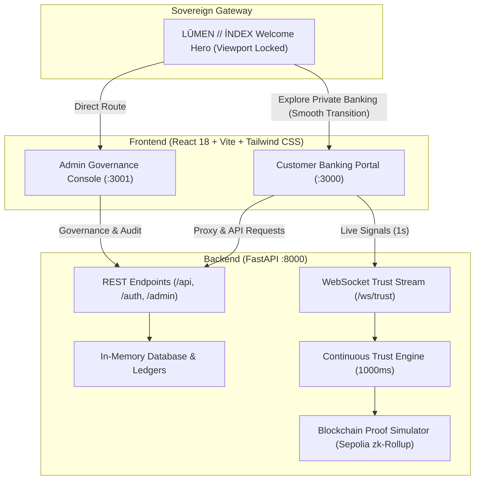

# Nexus BlockBank — AI-Resistant Continuous Identity & Digital Banking Platform

Nexus BlockBank is a full-stack banking and identity-verification platform. It combines a customer banking portal, an administrative control console, FastAPI APIs, continuous biometric/trust-session evaluation, and simulated blockchain verification in a clean two-tier architecture (`backend/` + `frontend/`).

---

## 🏛️ Architecture Overview

The system is organized into a modular **Backend** and a unified **Frontend** fronted by the **LŪMEN // ÍNDEX** sovereign DeFi gateway:



| Component | Port (Dev) | Route (Prod) | Purpose |
|---|---|---|---|
| **LŪMEN // ÍNDEX Gateway** | `http://localhost:3000` | `/` | Ultra-high-fidelity DeFi private banking landing & welcome hero |
| **Customer Portal** | `http://localhost:3000` | `/?view=app` | Banking dashboard, transfers, UPI, cards, loans, KYC & profile |
| **Admin Portal** | `http://localhost:3001` | `/admin/` | Node governance, smart contracts, AML compliance, credentials |
| **FastAPI Backend** | `http://localhost:8000` | `/` (API) | Core banking APIs, authentication, WebSocket trust engine |
| **API Docs (Swagger)** | `http://localhost:8000/docs` | `/docs` | Interactive OpenAPI documentation & testing |
| **API Health Check** | `http://localhost:8000/health` | `/health` | Live service health & metrics |

---

## ✨ LŪMEN // ÍNDEX — Sovereign DeFi & Private Banking Experience

The platform features an initial **LŪMEN // ÍNDEX** DeFi & private-banking landing page rendering before all other views:

### 🌟 Visual & Architectural Highlights

* **Pure Viewport Lock (`h-screen overflow-hidden`):** Zero scroll, mathematical layout alignment using a unified **20px (mobile) / 35px (`md`+)** gutter.
* **Full-Bleed Ambient Neural Video (Layer 0):** Autoplaying, looped, muted cinematic video backdrop without artificial dark scrims.
* **Double Typography Stack:**
  * **Display Font:** `Graphik LCG Regular Regular` for the `LŪMEN // ÍNDEX` wordmark and `Liquid Assets. Luminous Returns.` H1.
  * **UI Font:** `Manrope` (400/500) for all telemetry chips, node labels, and technical parameters.
* **Precision Viewport Grid System:** 4 vertical lines (`12.6%`, `37.5%`, `61.9%`, `86.2%`), 2 horizontal lines (`32.7%`, `71.4%`), and 8 plus intersections with `-translate-x-1/2 -translate-y-1/2` optical centering.
* **Distributed Neural Node Topology:**
  * `[ CORE_ENTITY ]` — Neural node processing real-time data streams (`top-[27%] left-[60%]`).
  * `[ LUMINOUS_INSIGHT ]` — Deep-learning engine synthesizing raw inputs (`top-[58%] left-[32%]`).
  * `[ CONNECTIVITY ]` — Latency-free transmission across distributed networks (`top-[63%] left-[50%]`).
  * 6 vector SVG elbow connector lines linking labels to squares with pixel-perfect coordinate precision.
* **Chamfered Institutional Info Card:** 45° angled corner border drawn via inline SVG polygon (`0.5,0.5 279.5,0.5 279.5,167.5 30,167.5 0.5,137.5`), `NOT A BANK — AN ECOSYSTEM` badge, and `VIEW_TRANSPARENCY_REPORT` link.
* **Cinematic Page Transitions:** Smooth `cubic-bezier(0.76, 0, 0.24, 1)` scaling blur-fade transition seamlessly moving users from the welcome page into the private banking workspace.

---

## 🛡️ 14-Clause Cryptographic Rules & Regulations System

Authentication incorporates an authentic 14-clause regulatory and Web3 agreement:

1. **Zero-Knowledge Cryptographic Proofs & Identity Vectors:** Privacy-preserving biometric and credential assertions.
2. **Continuous Telemetry & Dynamic Trust Scoring:** Real-time session monitoring with 1000ms WebSocket heartbeats.
3. **Immutable Ledger State on Ethereum Sepolia zk-Rollup:** Cryptographic immutability and verifiable transaction state.
4. **Multi-Jurisdictional RBI, Basel III & GDPR Compliance:** Cross-border prudential and data privacy compliance.
5. **Step-Up Cryptographic Challenges & Non-Custodial MFA:** Dynamic authentication triggered by trust-score decay.
6. **Institutional Vault Safeguards & Asset Segregation:** Tier-1 reserve backing and cold-storage vault separation.
7. **Real-Time NPCI UPI 2.0 Fast-Path Interoperability:** Instant zero-fee peer-to-peer and merchant routing.
8. **Hardware Security Module (HSM) & FIDO2 Key Binding:** Cryptographic device attestation and WebAuthn credentials.
9. **Autonomous Smart Contract Emergency Freezes:** Multi-signature regulatory circuit breakers.
10. **7-Year Immutable PBFT Audit Trail Retention:** Tamper-evident session and transaction logging.
11. **Oracle Governance & Cross-Chain State Anchoring:** Byzantine Fault Tolerant price feeds and state validation.
12. **Decentralized Key Custody & Loss of Private Keys:** Self-sovereign recovery parameters and guardian social recovery.
13. **Right to Erasure with Cryptographic Vector Shredding:** GDPR-compliant biometric vector shredding.
14. **Dispute Resolution & UNCITRAL Smart Arbitration:** On-chain arbitration and legally binding resolution mechanisms.

---

## 💎 Sovereign Profile & Cryptographic Vault

The customer profile section provides an institutional-grade sovereign management suite:

* **Executive Identity Banner:** Initials avatar badge, customer tier, verified sovereign status tag, and 99.4% live trust score.
* **Financial Portfolio Metric Cards:** Net worth (`₹14,85,250.00`), liquid reserve cash (`₹4,32,100.00`), CIBIL / Credit index (`840/900 Tier 1 Prime`), and daily limit (`₹10,00,000.00`).
* **One-Click Cryptographic Copy:** Instant clipboard copy with visual checkmark feedback for **Unique User ZK Key** and **Sepolia Ledger Wallet Address**.
* **5 Dedicated Sub-Navigation Suites:**
  1. *Personal & Contact Details* — Full name, DOB, gender, phone, email, residential address, country jurisdiction.
  2. *Banking & Financial Limits* — Primary checking `ACC-NEX-884920`, UPI `aarav_sharma@nexusbank`, RTGS / Wire caps.
  3. *Cryptographic & Security Keys* — Retina Biometric Hash Vector, EIP-712 session tickets, and FIDO2 binding.
  4. *KYC Document Vault* — Aadhaar UIDAI ZK-XML, PAN Card, Passport, front/back scan encryption.
  5. *Immutable Audit Timeline* — Session timestamps, EIP-712 token issuance, and ZK verification logs.

---

## 📁 Project Structure

```text
Nexus/
├── backend/                             # Python FastAPI application
│   ├── app/
│   │   ├── __init__.py                  # App package initialization
│   │   ├── main.py                      # FastAPI routes, WebSocket endpoints, static mounts
│   │   ├── config.py                    # Environment, CORS, and security configuration
│   │   ├── database.py                  # In-memory store, demo seeds & blockchain metadata
│   │   ├── models.py                    # Pydantic request/response data schemas
│   │   ├── passwords.py                 # Password hashing & verification
│   │   ├── security.py                  # JWT creation, role checks & access rules
│   │   ├── trust_engine.py              # Continuous trust score & risk level evaluator
│   │   └── blockchain_proof.py          # Sepolia ZK rollup proof verification simulator
│   ├── .env.example                     # Backend environment template
│   ├── requirements.txt                 # Production backend dependencies
│   ├── requirements-dev.txt             # Testing & development dependencies
│   ├── run.py                           # Backend entry point script
│   └── test_api.py                      # Comprehensive automated test suite
│
├── frontend/                            # Consolidated React + Vite frontend
│   ├── public/                          # Static assets and video backgrounds
│   │   ├── Hero page.mp4
│   │   └── hero_video.mp4
│   ├── src/
│   │   ├── components/                  # Customer & Admin UI components
│   │   │   ├── admin/                   # Admin Governance components
│   │   │   │   ├── panels/              # Admin-specific control panels
│   │   │   │   │   ├── AdminVerificationReview.jsx
│   │   │   │   │   ├── AMLCompliancePanel.jsx
│   │   │   │   │   ├── AuditCompliance.jsx
│   │   │   │   │   ├── BankingAdminDashboard.jsx
│   │   │   │   │   ├── CredentialManagement.jsx
│   │   │   │   │   ├── LiveSessions.jsx
│   │   │   │   │   ├── SmartContractRegistry.jsx
│   │   │   │   │   ├── SuperAdminDashboard.jsx
│   │   │   │   │   └── ValidatorNodesPanel.jsx
│   │   │   │   ├── AdminLogin.jsx       # Admin portal dedicated sign-in
│   │   │   │   ├── AdminNavbar.jsx      # Admin top navigation bar
│   │   │   │   ├── AdminSidebar.jsx     # Admin collapsible sidebar
│   │   │   │   ├── BackgroundVideo.jsx  # Admin background video wrapper
│   │   │   │   └── Shared.jsx           # Admin reusable UI primitives & tables
│   │   │   │
│   │   │   ├── panels/                  # Customer Banking panels
│   │   │   │   ├── AccountsPanel.jsx    # Savings, checking & deposit management
│   │   │   │   ├── AnalyticsPanel.jsx   # Spending analytics & cashflow breakdown
│   │   │   │   ├── AttendancePanel.jsx  # Identity verification history log
│   │   │   │   ├── AuditLogs.jsx        # Tamper-evident user audit records
│   │   │   │   ├── BankingDashboard.jsx # Main customer overview & quick actions
│   │   │   │   ├── CardsPanel.jsx       # Virtual & physical debit/credit cards
│   │   │   │   ├── ClientDashboard.jsx  # Continuous trust stream view
│   │   │   │   ├── ExamSecurity.jsx     # High-assurance session proctoring
│   │   │   │   ├── KYCIdentityPanel.jsx # Biometric & document verification
│   │   │   │   ├── LoansDepositsPanel.jsx # Fixed deposits & instant loan requests
│   │   │   │   ├── MetadataExplorer.jsx # 60+ field blockchain metadata inspector
│   │   │   │   ├── PaymentsUPIPanel.jsx # P2P transfers & UPI payments
│   │   │   │   ├── ProfilePanel.jsx     # User settings, retina vectors & keys
│   │   │   │   └── RewardsSupportPanel.jsx # Cashbacks & 24/7 bank support
│   │   │   ├── LumenHero.jsx            # LŪMEN // ÍNDEX sovereign welcome hero
│   │   │   ├── LumenHero.tsx            # TypeScript implementation of LumenHero
│   │   │   ├── AuthModal.jsx            # Customer credentials & Web3 sign-in modal
│   │   │   ├── BackgroundVideo.jsx      # Customer portal ambient video
│   │   │   ├── Shared.jsx               # Customer reusable UI components
│   │   │   ├── Sidebar.jsx              # Customer portal navigation sidebar
│   │   │   ├── StepUpChallenge.jsx      # Step-up biometric challenge modal
│   │   │   ├── TermsModal.jsx           # Terms consent cryptographic signing modal
│   │   │   ├── TrustScoreBadge.jsx      # Real-time continuous trust indicator
│   │   │   └── WalletCard.jsx           # Sepolia wallet balance & status card
│   │   ├── admin-main.jsx               # Entry point mounting <AdminApp />
│   │   ├── admin.css                    # Admin governance portal CSS theme
│   │   ├── AdminApp.jsx                 # Admin Governance Portal root component
│   │   ├── api.js                       # Unified API client, hooks & CSV exporter
│   │   ├── ClientApp.jsx                # Customer Banking Portal root component
│   │   ├── index.css                    # Customer portal styles, Tailwind & keyframes
│   │   ├── main.jsx                     # Entry point mounting <Root /> with Welcome flow
│   │   └── motion.js                    # Delegated 3D tilt & reveal-on-scroll animations
│   ├── .env.example                     # Frontend environment variables template
│   ├── admin.html                       # Admin portal HTML shell (port 3001)
│   ├── index.html                       # Customer portal HTML shell (port 3000)
│   ├── package.json                     # Merged frontend dependencies & scripts
│   ├── postcss.config.js                # PostCSS Tailwind configuration
│   ├── tailwind.config.js               # Tailwind CSS arbitrary-value configuration
│   ├── vite.config.js                   # Client Vite config (port 3000 -> 8000 proxy)
│   └── vite.config.admin.js             # Admin Vite config (port 3001 -> 8000 proxy)
│
├── .dockerignore                        # Docker build ignore patterns
├── .gitignore                           # Git ignore rules
├── AGENTS.md                            # Agent instructions & graphify rules
├── Dockerfile                           # Multi-stage production container build
├── README.md                            # Project documentation & execution guide
└── run_all.bat                          # One-click Windows development launcher
```

---

## ⚙️ Prerequisites

Ensure you have the following installed on your machine:

- **Python**: Version 3.10 or higher (`python --version`)
- **Node.js**: Version 18 or higher (`node --version`)
- **npm**: Version 9 or higher (`npm --version`)
- **Docker Desktop** *(Optional, for containerized execution)*

---

## 🚀 Execution Process (Step-by-Step)

### Option 1: Quick Start (Windows)

1. **Install dependencies once**:
   ```powershell
   # 1. Install Backend Dependencies
   cd backend
   python -m pip install -r requirements-dev.txt
   cd ..

   # 2. Install Frontend Dependencies
   cd frontend
   npm install
   cd ..
   ```

2. **Launch all services**:
   Double-click `run_all.bat` or run:
   ```powershell
   .\run_all.bat
   ```
   *This automatically opens three terminal windows launching the Backend (8000), Customer Portal (3000), and Admin Portal (3001).*

---

### Option 2: Manual Terminal Execution (Any OS)

Open three terminal tabs or windows in the project root:

#### Terminal 1 — Start the Backend (Port 8000)
```bash
cd backend
python -m pip install -r requirements-dev.txt
python run.py
```
> Backend runs at: `http://localhost:8000` (Health: `http://localhost:8000/health`)

#### Terminal 2 — Start the Customer Portal (Port 3000)
```bash
cd frontend
npm install
npm run dev
```
> Customer Portal runs at: `http://localhost:3000`

#### Terminal 3 — Start the Admin Governance Portal (Port 3001)
```bash
cd frontend
npm run dev:admin
```
> Admin Portal runs at: `http://localhost:3001`

---

### Option 3: Full-Stack Docker Container

To run both backend and frontend bundled as a single production service:

1. **Build the Docker image**:
   ```bash
   docker build -t nexus-blockbank .
   ```

2. **Run the container**:
   ```bash
   docker run --rm -p 8000:8000 \
     -e APP_ENV=production \
     -e DEMO_MODE=true \
     -e JWT_SECRET=nexus-development-secret-32-characters-minimum \
     -e ADMIN_PASSWORD=SuperAdmin@2026 \
     -e DEMO_USER_PASSWORD=password123 \
     -e CORS_ORIGINS=http://localhost:8000 \
     nexus-blockbank
   ```

3. **Access the application**:
   - Customer Portal: `http://localhost:8000/`
   - Admin Portal: `http://localhost:8000/admin/`
   - Swagger Docs: `http://localhost:8000/docs`

---

## 🔑 Demo Login Credentials

The application is pre-seeded with development credentials for instant testing:

| Portal | URL | Username / ID | Password | Role / Access |
|---|---|---|---|---|
| **Customer Portal** | `http://localhost:3000` | `aarav_sharma` | `password123` | Retail Customer (Savings, Cards, Loans, UPI) |
| **Admin Portal** | `http://localhost:3001` | `superadmin` | `SuperAdmin@2026` | Platform Super Admin (Validators, AML, Smart Contracts) |

---

## 🧪 Testing & Building

### 1. Run Backend Automated Tests
```powershell
python -m pytest backend/test_api.py -v
```
*Runs all test suites covering authentication, customer transfers, role authorization, WebSockets, and static serving.*

### 2. Test Production Frontend Builds
```powershell
cd frontend
npm run build:client   # Builds Customer Portal to dist/client/
npm run build:admin    # Builds Admin Portal to dist/admin/
```

---

## 🔧 Environment Configuration

You can customize runtime behavior by creating a `.env` file in `backend/` based on `backend/.env.example`:

| Variable | Default (Dev) | Production Required | Description |
|---|---|---|---|
| `APP_ENV` | `development` | Yes (`production`) | Application runtime environment |
| `DEMO_MODE` | `true` | No | Auto-seeds demo user accounts & data |
| `JWT_SECRET` | *(auto-dev)* | Yes (min 32 chars) | Secret key for signing JWT tokens |
| `ADMIN_USERNAME` | `superadmin` | No | Root administrator account username |
| `ADMIN_PASSWORD` | `SuperAdmin@2026` | Yes in production | Root administrator password |
| `DEMO_USER_PASSWORD` | `password123` | Yes if demo mode | Password for seeded customer account |
| `PUBLIC_SIGNUP_ENABLED` | `true` (dev) | No | Allow public self-registration |
| `WEB3_DEMO_AUTH_ENABLED`| `true` (dev) | No | Allow Web3 wallet demo sign-in |
| `HOST` | `127.0.0.1` | No (`0.0.0.0`) | Host bind address |
| `PORT` | `8000` | No | Backend HTTP port |
